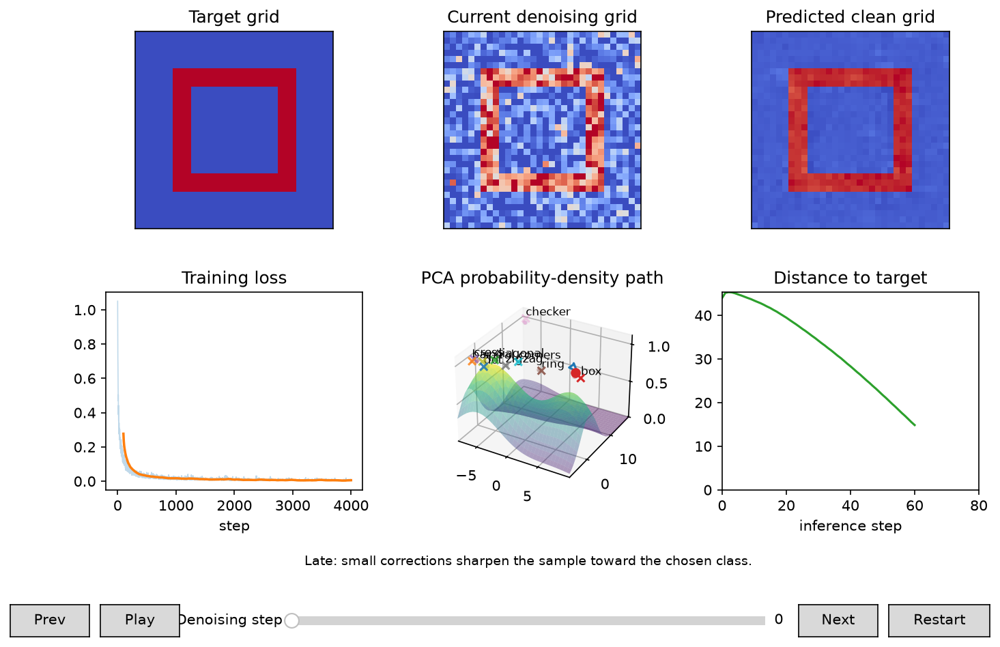

# Grid Diffusion Learning

Learn diffusion by training a small class-conditional model on ten synthetic `32x32` grids. The interactive visualization lets you pause, scrub, and inspect how noise becomes a predicted clean pattern—without needing an image dataset.

## Interactive Lesson



_A real checkpoint trained for 4,000 steps, then sampled as `box` with seed `3`, DDIM 80 steps, and guidance `1.0`. The preview is paused late in denoising so the remaining noise and the cleaner `x_0` prediction can be compared._

The top row compares the target, current noisy state `x_t`, and predicted clean state `x_0`. The bottom row connects training loss, the sample's path through PCA space, and distance to the target. Use the controls to inspect any recorded denoising step.

## Quickstart

```bash
uv sync
uv run diffusion-demo --target diagonal --train-steps 4000 --seed 0
```

In a headless or CI environment, the same command saves `diffusion-result.png`. To save explicitly instead of opening the interactive window:

```bash
uv run diffusion-demo --mode infer --checkpoint diffusion-demo.pt --output diffusion-result.png
```

Targets: `dot`, `bar`, `diagonal`, `box`, `cross`, `ring`, `checker`, `zigzag`, `spiral`, `corners`.

Useful flags:

```bash
uv run diffusion-demo --target cross --train-steps 800 --sample-steps 60 --device cpu
uv run diffusion-demo --target box --sampler ddim --sample-steps 80 --eta 0
```

`--device auto` uses Apple MPS when available, otherwise CPU. DDPM sampling is the default and uses `--diffusion-steps` frames unless `--sample-steps` is set. DDIM is available as a faster optional sampler.

## Learn By Tweaking

The result window is an interactive lesson:

- **Pause / Play** stops and resumes denoising.
- **Prev / Next** moves one recorded step at a time.
- **Denoising step** scrubs anywhere through the trajectory.
- **Restart** returns to the initial noise so you can watch a feature form again.

The sentence above the controls explains what to look for in the early, middle, and late phases. Compare the current grid with the predicted clean grid: `x_t` can remain noisy while the model's estimate of `x_0` already has recognizable structure.

Try these small experiments after training one checkpoint:

| Question | Command change | What to watch |
|---|---|---|
| Does conditioning matter? | Compare `--guidance-scale 0`, `1`, and `4` | Class resemblance versus artifacts |
| Can sampling be faster? | Use `--sampler ddim --sample-steps 20`, then `80` | Speed versus refinement |
| What does randomness change? | Change `--seed` | Different samples for the same class |
| What does DDIM noise do? | Compare `--eta 0` and `--eta 1` | Deterministic versus stochastic paths |
| Does the schedule matter? | Train with `--schedule linear`, then `cosine` | Loss and denoising trajectory |

Keep the checkpoint fixed when comparing inference flags. Retrain only when comparing training flags such as `--schedule`, `--cond-drop`, or `--ema-decay`; otherwise two variables change at once.

## Separate Training And Inference

The default `--mode run` trains, saves a checkpoint, then samples. To train once and reuse the EMA model:

```bash
uv run diffusion-demo --mode train --checkpoint demo.pt --train-steps 10000
uv run diffusion-demo --mode infer --checkpoint demo.pt --target ring --sampler ddim --sample-steps 80
```

Inference loads the checkpoint's EMA weights, schedule type, training losses, and diffusion step count.

## What It Teaches

The clean grid is `x_0`. Forward diffusion adds Gaussian noise:

```text
x_t = sqrt(alpha_bar_t) * x_0 + sqrt(1 - alpha_bar_t) * epsilon
```

The model learns to predict `epsilon` from the noisy grid `x_t`, timestep `t`, and target pattern id, with classifier-free label dropout during training. During reverse diffusion, the predicted noise gives an estimate of the clean grid:

```text
pred_x0 = (x_t - sqrt(1 - alpha_bar_t) * pred_epsilon) / sqrt(alpha_bar_t)
```

The displayed target grid is a conditioning-label reference only. The model never receives the clean target image, and the sampler does not blend toward it.

## Techniques Used

**Synthetic grid dataset.** The dataset is ten hand-written `32x32` binary patterns. Each training example is a clean image `x_0` plus a class label such as `ring` or `cross`. This keeps the demo small enough to run locally while still using the same tensor shape convention as image diffusion: `(batch, channels, height, width)`.

**Noise schedule.** A schedule defines how much Gaussian noise is added at each timestep. The default is the cosine schedule with `s = 0.008`, which keeps early timesteps less destructive than a simple linear schedule. Linear scheduling is still available with `--schedule linear` for comparison.

**Forward diffusion.** Training samples a random timestep `t`, draws Gaussian noise `epsilon`, and builds `x_t` from `x_0`. The model only sees `x_t`, `t`, and a class label. It does not see the clean target grid.

**Epsilon prediction.** The U-Net predicts the noise that was added, not the clean image directly. The loss is plain mean squared error:

```text
loss = MSE(pred_epsilon, epsilon)
```

After prediction, the clean estimate can be recovered with the `pred_x0` formula above.

**Tiny U-Net.** `TinyUNet` is a small convolutional U-Net with residual blocks, GroupNorm, SiLU activations, downsampling, upsampling, and skip connections. Sinusoidal timestep embeddings tell the model how noisy the input is. Label embeddings tell it which pattern class to generate.

**Classifier-free guidance.** During training, labels are randomly replaced by a null label using `--cond-drop`. At sampling time the model predicts both an unconditional noise estimate and a conditional one:

```text
guided_epsilon = eps_uncond + guidance_scale * (eps_cond - eps_uncond)
```

Higher `--guidance-scale` follows the selected class more strongly, but too much guidance can make samples worse.

**EMA sampling.** Training keeps an exponential moving average copy of the model weights. Sampling uses the EMA model because it is usually smoother than the latest training step.

**DDPM sampler.** The default `--sampler ddpm` uses ancestral reverse diffusion. It walks through the full reverse chain and adds fresh noise at every step except the final one. This is the faithful stochastic sampler.

**DDIM sampler.** `--sampler ddim` is the fast sampler. It can skip timesteps and uses `--eta` to control extra noise. `--eta 0` is deterministic.

## Animation Panels

- Target grid: the selected clean pattern.
- Current grid: the current reverse-diffusion state.
- Predicted clean grid: the model's current `x_0` estimate.
- Training loss: loss over training steps.
- PCA path: a smooth probability-density surface in PCA space, with the denoising trajectory moving across it.
- Distance: Euclidean distance from the current grid to the target over inference steps.

## Tests

```bash
uv run python -m unittest
```
